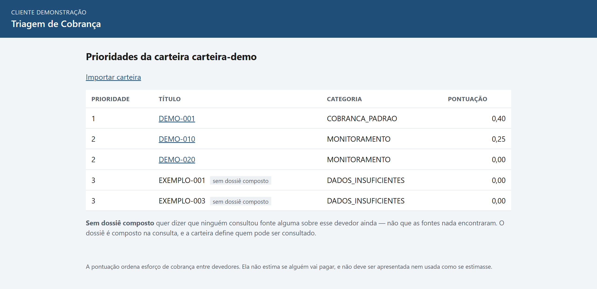
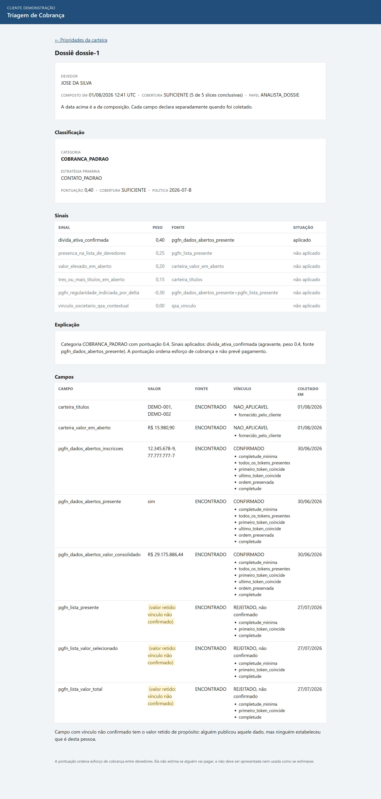
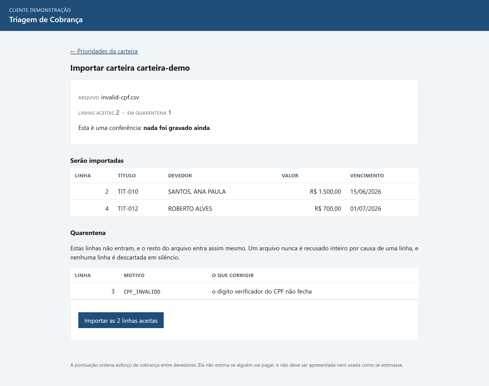

# Dossiê de triagem

Motor que, a partir de nome + CPF de um devedor **já presente na carteira do
cliente**, monta um dossiê estruturado de fontes públicas e produz uma
classificação acionável de **como cobrar**. Não é score de crédito: a pontuação
ordena esforço de cobrança e não estima se alguém vai pagar.

O consumidor final é um agente de AI. O contrato de saída é o produto; a UI é
camada de entrega.

## As três telas



**Prioridades da carteira.** A fila ordenada por categoria e pontuação, não por
valor devido: a pontuação ordena **esforço de cobrança**, e o rodapé diz isso em
toda tela para que ninguém a leia como probabilidade de pagamento.



**Dossiê.** Cada campo carrega valor, fonte, vínculo e data de coleta. O campo
com vínculo não confirmado aparece **com o valor retido** — alguém publicou
aquele dado, mas ninguém estabeleceu que é desta pessoa. Abaixo, os sinais
nomeados com peso e fonte, e a explicação por extenso que o direito de revisão
de decisão automatizada exige.



**Importação de carteira.** A conferência antes de gravar: o que seria aceito e
o que vai para quarentena, com **número da linha e motivo** — nunca o CPF. Uma
linha inválida não derruba o arquivo inteiro, e nenhuma linha é descartada em
silêncio.

- Regras permanentes do projeto: [`AGENTS.md`](AGENTS.md)
- Decisões fechadas: [`docs/decisions/README.md`](docs/decisions/README.md)
- Fontes, custo e base legal: [`docs/fontes.md`](docs/fontes.md)
- LGPD, retenção e expurgo: [`docs/lgpd.md`](docs/lgpd.md)
- O que a v1 não faz, e por quê: [`docs/limitacoes-v1.md`](docs/limitacoes-v1.md)
- Para onde isso vai depois: [`docs/proximos-passos.md`](docs/proximos-passos.md)
- Casos conferíveis à mão: [`docs/casos-de-teste.md`](docs/casos-de-teste.md)
- Roteiro de demonstração em 10 minutos: [`docs/demonstracao.md`](docs/demonstracao.md)
- **Contrato da API, em página legível:** [`docs/openapi.html`](docs/openapi.html)

### Sobre o contrato publicável e a aplicação não publicada

`docs/openapi.html` é gerado a partir dos mesmos schemas Zod que o servidor
valida em runtime, e é um arquivo estático e autocontido — sem CDN, sem banco
atrás. **Ele pode ser publicado** (GitHub Pages, por exemplo).

**A aplicação, não.** O sistema falha fechado sem verificação de JWT/JWKS
(pendência P-1): fora de `NODE_ENV=development` nenhuma principal verificada é
emitida, em nenhuma chamada. Publicá-la exigiria desligar essa guarda num
sistema que decifra CPF. O raciocínio inteiro está em
[`docs/limitacoes-v1.md`](docs/limitacoes-v1.md), na seção de decisões de
escopo. Publicar contrato não é publicar sistema.

## Para quem só quer ver

Com a preparação feita (passos 1 a 5 abaixo) e o `pnpm demo` no ar, é isto:

| Tela | Cole no navegador |
|---|---|
| **Prioridades da carteira** | http://127.0.0.1:3000/carteiras/carteira-demo/prioridades |
| **Dossiê** | http://127.0.0.1:3000/carteiras/carteira-demo/dossies/dossie-1 |
| **Importar carteira** | http://127.0.0.1:3000/carteiras/carteira-demo/importacoes |

O navegador pede usuário e senha: **`demo` / `demo`**. Qualquer par serve —
nada é conferido, e o passo 9 explica por quê.

As rotas de API (`/api/...`) **não** abrem no navegador: elas exigem o cabeçalho
`Authorization`, e barra de endereço não manda cabeçalho. Para elas, passos 6 a 8.

## Pré-requisitos

- **Node.js 22 ou superior**
- **pnpm 11** — vem com o Node via `corepack enable`
- **Docker** com Compose v2

## Subindo tudo do zero

A sequência abaixo vai de um clone limpo até os três endpoints e as três telas
respondendo.
Cada passo é um comando; nenhum deles pede confirmação.

### 1. Instalar as dependências

```bash
pnpm install --frozen-lockfile
```

**Resposta correta:** termina sem erro. Numa máquina limpa demora alguns
minutos; em reexecuções responde `Already up to date`.

### 2. Gerar o Prisma Client

```bash
pnpm exec prisma generate
```

**Resposta correta:** `Generated Prisma Client (v6.19.0)`.

Este passo é obrigatório num clone novo, e precisa ser repetido depois de
qualquer reinstalação de `node_modules` — o cliente gerado mora dentro dela.
Sem ele o `pnpm typecheck` acusa `implicitly has an 'any' type` em callbacks de
`$transaction`, que é defeito de ambiente (E-2) e não regressão de produto.

### 3. Subir o Compose

```bash
pnpm compose:up
```

Sobe PostgreSQL e Keycloak em background e **espera os dois ficarem
saudáveis** antes de devolver o terminal.

**Resposta correta:** as últimas linhas dizem `Healthy` para os dois
containers e o comando sai com código 0.

O PostgreSQL fica em `127.0.0.1:5433` — só loopback, e numa porta fora da
padrão para não colidir com um PostgreSQL já instalado na máquina.

### 4. Aplicar as migrações

```bash
pnpm migrate
```

**Resposta correta:** `2 migrations found in prisma/migrations` seguido de
`No pending migrations to apply` (banco já migrado) ou da lista das migrações
aplicadas (banco novo).

Este comando roda o Prisma **no host**, contra a porta que o Compose publica.
Existe também `pnpm migrate:compose`, que roda a migração dentro da rede do
Compose — use essa no Linux ou em CI, **nunca no Windows**: ela depende do
serviço `workspace-dependencies`, que reescreve `packages/*/node_modules` com
reparse points que o Windows não resolve. É o defeito E-1 de
[`docs/limitacoes-v1.md`](docs/limitacoes-v1.md).

### 5. Semear o banco e subir a API

```bash
pnpm demo
```

Um comando faz o fluxo inteiro, sempre a partir de um estado limpo do tenant de
demonstração: importa a planilha Excel da carteira, roda os dois universos da
PGFN sobre as fixtures commitadas, grava as observações no PostgreSQL, compõe um
dossiê por devedor, classifica cada um e então sobe a API em
`http://127.0.0.1:3000`.

**Resposta correta:** o console imprime a carteira semeada, a fila de
prioridades e, no fim, **os endereços de tudo que subiu** — os três endpoints e
as três telas. É esta a saída inteira:

```
Carteira carteira-demo do tenant tenant-demo
3 devedores, 0 linhas em quarentena

Prioridades da carteira:
  dossie-1  COBRANCA_PADRAO       pontuação 0.40  DEMO-001  JOSE DA SILVA
  dossie-2  MONITORAMENTO         pontuação 0.25  DEMO-010  JOSE DA SILVA SANTOS
  dossie-3  MONITORAMENTO         pontuação 0.00  DEMO-020  ANA LUCIA FERREIRA

Endpoints:
  POST http://127.0.0.1:3000/api/v1/carteiras/carteira-demo/dossies/lookup  {"id_externo":"DEMO-001"}
  GET  http://127.0.0.1:3000/api/v1/carteiras/carteira-demo/prioridades
  GET  http://127.0.0.1:3000/api/v1/dossies/dossie-1/prompt?carteira=carteira-demo


Telas:
  http://127.0.0.1:3000/carteiras/carteira-demo/prioridades
  http://127.0.0.1:3000/carteiras/carteira-demo/dossies/dossie-1
  http://127.0.0.1:3000/carteiras/carteira-demo/importacoes

Toda requisição precisa do cabeçalho: Authorization: Bearer demo
No navegador, as telas pedem usuário e senha: use demo / demo. Qualquer par serve — nada é conferido, e esta identidade de desenvolvimento não autentica ninguém (ADR 021).
Ctrl+C encerra.
```

**Se você só quer ver o sistema, pare aqui e cole no navegador o primeiro
endereço de "Telas".** Usuário `demo`, senha `demo`. O passo 9 explica as duas
telas em detalhe; os passos 6 a 8 são a API, e podem esperar.

O processo fica no ar até `Ctrl+C`. Rode os passos 6 a 9 num segundo terminal.

> **Semear e servir moram no mesmo processo de propósito.** O cofre de chaves
> AEAD é em memória (pendência F-5), então o processo que cifrou um CPF é o
> único capaz de lê-lo de volta. O entrypoint recusa qualquer banco que não
> esteja em loopback antes de assumir `NODE_ENV=development`, de modo que a
> identidade de desenvolvimento que ele usa nunca possa ser apontada para dado
> real. Produção continua proibida até a validação de JWT/JWKS — pendência P-1.

> **Windows: os comandos `curl` abaixo não rodam no PowerShell.** Lá `curl` é
> apelido de `Invoke-WebRequest`, que não conhece `-s`, `-X` nem `-H` e recusa o
> comando com "Não é possível associar o parâmetro 'Headers'". Cada passo traz a
> versão PowerShell ao lado. Se preferir o curl de verdade, chame `curl.exe`
> pelo nome completo: nas requisições `GET` os comandos bash valem sem nenhuma
> mudança. No `POST` do passo 6 **não** valem — o PowerShell reescreve as aspas
> internas do corpo antes de o curl vê-lo e a resposta vira
> `{"erro":"CORPO_NAO_E_JSON"}`, inclusive com `--%`. Por isso a versão Windows
> do passo 6 usa `Invoke-RestMethod`.

### 6. Endpoint de consulta de dossiê

```bash
curl -s -X POST http://127.0.0.1:3000/api/v1/carteiras/carteira-demo/dossies/lookup -H "Authorization: Bearer demo" -H "Content-Type: application/json" -d "{\"id_externo\":\"DEMO-001\"}"
```

No PowerShell:

```powershell
Invoke-RestMethod -Method Post -Uri http://127.0.0.1:3000/api/v1/carteiras/carteira-demo/dossies/lookup -Headers @{ Authorization = "Bearer demo" } -ContentType "application/json" -Body '{"id_externo":"DEMO-001"}' | ConvertTo-Json -Depth 5
```

**Resposta correta:** HTTP 200 com um JSON de dois campos, `dossier` e
`classification`:

```json
{
  "dossier": {
    "dossier_id": "b23fd50f-...",
    "schema_version": "2.0.0",
    "composed_at": "2026-07-31T17:40:28.660Z",
    "cobertura": "SUFICIENTE"
  },
  "classification": {
    "category": "COBRANCA_PADRAO",
    "score": 0.4,
    "signals": [ { "nome": "divida_ativa_confirmada", "peso": 0.4, "aplicado": true } ],
    "explicacao": "Categoria COBRANCA_PADRAO com pontuação 0.4. ..."
  }
}
```

O único identificador que o chamador segura é o `id_externo` do título. **Não
existe consulta por CPF** em corpo, URL ou query string, e o schema é estrito:
mandar `{"cpf": "..."}` devolve 400 `REQUISICAO_INVALIDA`. É `POST` porque um
`GET` poria o identificador na URL, e dali em todo log de acesso e cache de
proxy — um `GET` nessa rota devolve 405.

Cada chamada compõe um dossiê novo, então `dossier_id` muda a cada requisição:
o dossiê é um snapshot imutável de um instante, nunca um registro editado.

### 7. Endpoint de prioridades da carteira

**Esta rota não abre no navegador.** Toda rota exige o cabeçalho
`Authorization`, e uma barra de endereço não manda cabeçalho nenhum: o
navegador recebe 401 `NAO_AUTENTICADO` e nada mais, porque a resposta da API é
deliberadamente pobre em informação. Use a linha de comando aqui; a fila para
ler numa tela é o passo 9, e lá a resposta 401 pede a credencial ao navegador.

```bash
curl -s http://127.0.0.1:3000/api/v1/carteiras/carteira-demo/prioridades -H "Authorization: Bearer demo"
```

No PowerShell:

```powershell
Invoke-RestMethod -Uri http://127.0.0.1:3000/api/v1/carteiras/carteira-demo/prioridades -Headers @{ Authorization = "Bearer demo" } | ConvertTo-Json -Depth 5
```

**Resposta correta:** HTTP 200 com a fila ordenada e um cursor de paginação:

```json
{
  "items": [
    { "dossier_id": "dossie-1", "id_externo": "DEMO-001", "categoria": "COBRANCA_PADRAO", "prioridade_operacional": 1, "pontuacao": 0.4 },
    { "dossier_id": "dossie-2", "id_externo": "DEMO-010", "categoria": "MONITORAMENTO", "prioridade_operacional": 2, "pontuacao": 0.25 },
    { "dossier_id": "dossie-3", "id_externo": "DEMO-020", "categoria": "MONITORAMENTO", "prioridade_operacional": 2, "pontuacao": 0 }
  ],
  "next_cursor": null
}
```

A paginação é keyset e o cursor é opaco por contrato: base64url de prioridade,
pontuação e id do dossiê, sem nada sobre pessoa.

### 8. Endpoint de prompt do dossiê

```bash
curl -s "http://127.0.0.1:3000/api/v1/dossies/dossie-1/prompt?carteira=carteira-demo" -H "Authorization: Bearer demo"
```

No PowerShell:

```powershell
Invoke-RestMethod -Uri "http://127.0.0.1:3000/api/v1/dossies/dossie-1/prompt?carteira=carteira-demo" -Headers @{ Authorization = "Bearer demo" }
```

**Resposta correta:** HTTP 200 com `content-type: text/markdown; charset=utf-8`
e o texto que vai para o agente — cobertura, campos com envelope, classificação
e sinais nomeados. Os trechos que provam que o motor está fazendo a coisa certa:

```markdown
## Cobertura
Veredito: **SUFICIENTE**
Slices conclusivas: 5 de 5

- **pgfn_dados_abertos_valor_consolidado** = R$ 29175886.44
  - vínculo CONFIRMADO, confiança 1
- **pgfn_lista_valor_total** = (valor retido: vínculo não confirmado)
  - vínculo REJEITADO, não confirmado, confiança 0.5
```

O segundo campo é o ponto: alguém publicou aquele valor, mas o resolvedor de
identidade **não** estabeleceu que é desta pessoa, então o valor sai retido em
vez de sair como fato. Isso vale para a saída do agente, para a UI e para o peso
do sinal.

Os três endpoints respondem `cache-control: no-store` — o dossiê é dado pessoal
de pessoa identificada. Sem o cabeçalho `Authorization` a resposta é 401.

### 9. As três telas

Cole no navegador, com o `pnpm demo` do passo 5 no ar:

| Tela | URL |
|---|---|
| **Prioridades da carteira** | `http://127.0.0.1:3000/carteiras/carteira-demo/prioridades` |
| **Dossiê** | `http://127.0.0.1:3000/carteiras/carteira-demo/dossies/dossie-1` |
| **Importar carteira** | `http://127.0.0.1:3000/carteiras/carteira-demo/importacoes` |

Da fila, clicar num título leva ao dossiê daquele devedor — `dossie-1`,
`dossie-2` e `dossie-3` são os três que o passo 5 semeou. O link "Importar
carteira", no topo da fila, leva à terceira tela.

#### Credenciais

O navegador abre uma caixa de usuário e senha. Use:

| Campo | Valor |
|---|---|
| Usuário | `demo` |
| Senha | `demo` |

**Qualquer par serve, e isso é o ponto.** Nada é conferido: a demonstração
emite identidade de desenvolvimento e não autentica ninguém. Só o *esquema* do
cabeçalho é lido — `Basic` ou `Bearer` —, exatamente como os passos 6 a 8
aceitam qualquer `Bearer`. Sem cabeçalho nenhum a resposta é 401. Autenticação
de verdade espera a validação de JWT/JWKS (ADR 021, pendência P-1), e até lá o
servidor **não sobe em produção**: fora de `NODE_ENV=development` nenhuma
principal é emitida.

A tela pede a credencial, e a rota `/api/` do passo 7 não, porque só a resposta
de página acompanha `WWW-Authenticate: Basic`. É o mesmo cabeçalho
`Authorization` nos dois casos, e a autorização por carteira é a mesma.

Na linha de comando as mesmas telas saem assim:

```bash
curl -s -u demo:demo http://127.0.0.1:3000/carteiras/carteira-demo/prioridades
```

No PowerShell:

```powershell
curl.exe -s -u demo:demo http://127.0.0.1:3000/carteiras/carteira-demo/prioridades
```

**Resposta correta:** a fila mostra os três dossiês ordenados por prioridade, e
a página do dossiê mostra os campos com envelope, os sinais nomeados com peso e
fonte, e a explicação por extenso. O que vale reparar:

- **Dinheiro e data em português.** `R$ 29.175.886,44` e `27/07/2026`. A
  formatação acontece só na borda de apresentação; o domínio segue com centavos
  inteiros e ISO-8601.
- **Valor retido.** `pgfn_lista_valor_total` aparece marcado como retido: alguém
  publicou aquele valor, mas o resolvedor não estabeleceu que é desta pessoa.
- **Nenhum CPF**, inteiro ou mascarado. A tela lê o nome dos títulos da carteira
  e não decifra documento nenhum.
- **A visão segue a concessão.** Quem tem `READ_DOSSIER` vê quais regras de
  correspondência casaram; quem tem só `READ_ACTIONABLE` vê quantas casaram, e
  não quais. O papel não é escolhido pela requisição.
- **White label.** Nome do produto, marca e cores vêm da linha do tenant no
  banco. Não há valor padrão: tenant sem tema configurado devolve 500
  `TEMA_NAO_CONFIGURADO`, porque um padrão seria a marca de quem desenvolveu com
  outro nome.

#### A tela de importação, em dois passos

É a tela que fecha o laço de uso: antes dela, carregar uma carteira exigia rodar
um script, o que é a resposta errada para "como o cliente carrega a carteira"
num sistema web.

1. **Escolha um arquivo e clique em "Conferir antes de importar".** Para ver a
   quarentena funcionando, use `fixtures/wallet/invalid-cpf.csv`: três linhas,
   uma delas com dígito verificador que não fecha.
2. **Confira e confirme.** A conferência mostra o que seria aceito — título,
   devedor, valor em reais e vencimento — e o que iria para quarentena, com
   **número da linha e motivo**. Só então o botão importa.

O que vale reparar aqui:

- **A conferência não grava nada.** Não é promessa desta tela: `previewWalletImport`
  não recebe store nenhum, então não tem como escrever. Recarregar a página sem
  confirmar não deixa rastro no banco.
- **Nenhum CPF aparece**, nem na lista aceita nem na quarentena. A linha em
  quarentena é identificada por número e motivo, porque o relatório é lido por
  uma pessoa e pode ser exportado.
- **Uma linha ruim não derruba o arquivo.** O resto entra, e nada é descartado
  em silêncio.
- **Reimportar não duplica.** O título é identificado pelo `id_externo`; a
  segunda passagem atualiza em vez de criar. Três parcelas do mesmo devedor são
  três títulos, não duplicata.
- **A importação é registrada**: quem, quando, hash do arquivo, linhas aceitas,
  linhas em quarentena e a contagem por motivo.
- **É o mesmo importador do passo 5.** A tela chama `previewWalletImport` e
  `commitWalletImport`, exatamente as funções que o `pnpm demo` chama para
  semear — e passa pela mesma autorização (`IMPORT_WALLET`) que a API exigiria.

Formatos aceitos: CSV (UTF-8, UTF-8 com BOM ou CP1252; delimitador `;` ou `,`;
decimal com vírgula) e XLSX. O formato é decidido pelos **bytes** do arquivo, não
pela extensão nem pelo `content-type` que o navegador mandou.

### 10. Derrubar

```bash
pnpm compose:down
```

Isso para os containers e **preserva** o volume do banco. Para começar de um
banco genuinamente vazio, `docker compose down -v` também apaga o volume — e aí
os passos 4 e 5 precisam ser repetidos.

## Testes

As suítes são separadas porque exigem coisas diferentes:

```bash
pnpm test:unit
```

585 testes, nenhum toca rede nem Docker. É a suíte que roda num clone limpo sem
nada no ar.

```bash
pnpm test:integration
```

13 testes contra o PostgreSQL real do Compose, via `docker compose exec` de
verdade e não mock: exigem os passos 3 e 4 feitos. Sem o stack de pé eles
falham, e é assim que deve ser.

```bash
pnpm test
```

Roda as suítes de cada pacote do workspace.

## Verificação

```bash
pnpm lint
pnpm typecheck
pnpm generate:contracts
```

`lint` é eslint com zero warnings, `typecheck` é `tsc` estrito sem emit, e
`generate:contracts` regenera JSON Schema, OpenAPI **e a página legível do
contrato** ([`docs/openapi.html`](docs/openapi.html)) a partir do Zod. O
contrato publicado nunca é escrito à mão: se `generate:contracts` produzir
diferença, o código mudou o contrato e a diferença é a mudança.

## Dados

Nenhum teste acessa rede ou usa dados reais de devedores. As fixtures são
sintéticas e preservam os padrões que importam — formato de máscara, homonímia,
anomalias estruturais de planilha. O arquivo real da Lista de Devedores contém
pessoas reais: fica no `.gitignore`, fora de log e fora de serviço de terceiro.

As credenciais que aparecem no `docker-compose.yml` e nos scripts são
exclusivamente locais de desenvolvimento e não valem em lugar nenhum além da
sua máquina.
